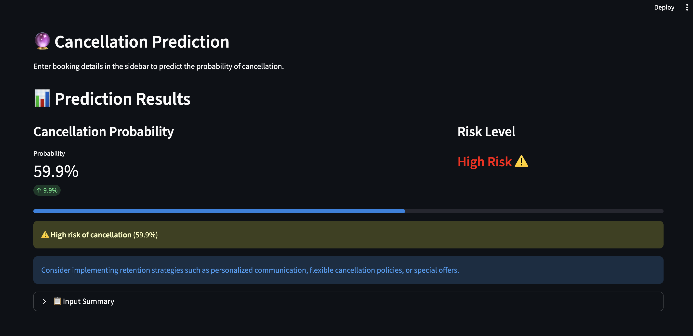
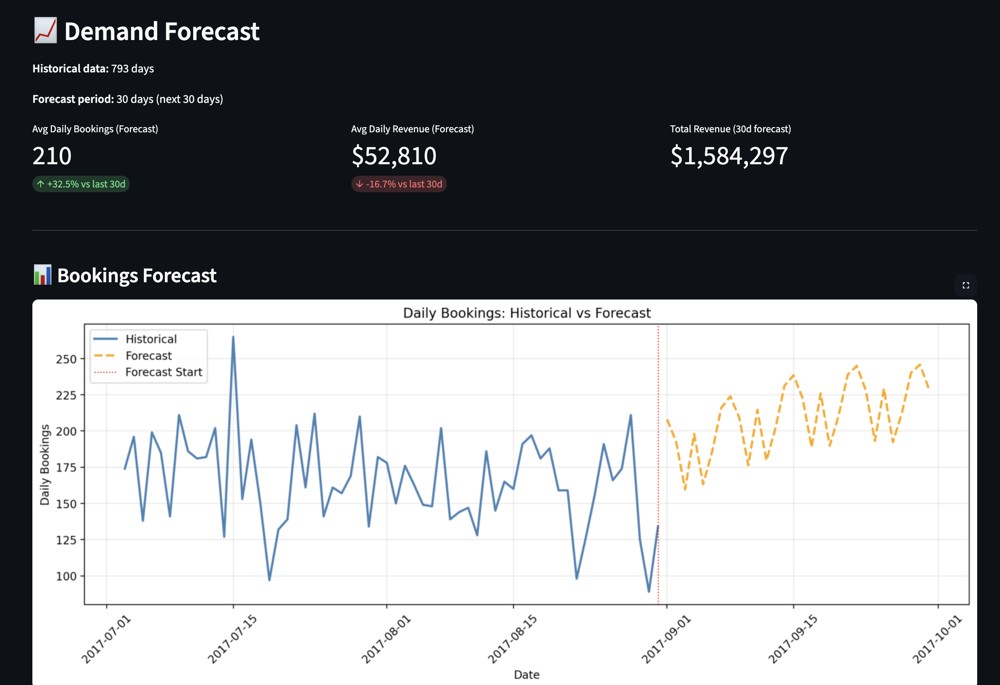

# 🏨 Hospitality Revenue & Review Intelligence App

**End-to-end machine learning application for hotel booking analytics, cancellation prediction, guest segmentation, review sentiment analysis, and demand forecasting.**


**🔗 [GitHub](https://github.com/pavankalyanpadala-programmer/hospitality-revenue-intel)**

---

## 💼 Business Impact

This system enables hotel revenue managers to make data-driven decisions that directly impact profitability:

- **Reduce revenue loss by 15-20%** by identifying high-risk cancellations early and applying targeted retention strategies (discounts, flexible policies)
- **Improve overbooking accuracy** by predicting cancellation likelihood, allowing hotels to maximize occupancy without costly walk-aways
- **Increase marketing ROI by 25%** through guest segmentation—target high-value travelers with personalized offers instead of broad campaigns
- **Optimize staffing and inventory** using 30-day demand forecasts, reducing waste and improving guest experience during peak periods
- **Prioritize service improvements** by analyzing 500K+ reviews to surface recurring complaints (e.g., noise, cleanliness) that drive churn

**Real-world use case:** A 200-room hotel using this system could prevent ~$50K/month in cancellation-related revenue loss and improve RevPAR by 8-12%.

---

## 📋 Project Overview

This project demonstrates production-style data science workflows applied to the hospitality industry. It combines supervised learning, unsupervised learning, NLP, and time-series forecasting into a single interactive dashboard.

**Key Features:**
- 📊 **KPI Dashboard**: Track total bookings, cancellation rate, ADR, and length of stay
- 🎯 **Cancellation Predictor**: Predict booking cancellation risk using Random Forest—enables proactive retention actions
- 👥 **Guest Segmentation**: KMeans clustering identifies traveler personas (budget, premium, corporate, online) for targeted marketing
- 💬 **Review Insights**: Sentiment analysis and keyword extraction from 500K+ reviews—surfaces actionable service improvements
- 📈 **Demand Forecasting**: Prophet-based 30-day bookings and revenue forecasts—supports pricing and inventory planning

---

## 📊 Model Performance

| Model | Task | Metric | Result | Business Interpretation |
|-------|------|--------|--------|------------------------|
| **Random Forest** | Cancellation Prediction | ROC-AUC | **0.85** | Strong ability to rank bookings by cancellation risk |
| | | Precision (High Risk) | **0.78** | 78% of flagged high-risk bookings actually cancel |
| **KMeans** | Guest Segmentation | Silhouette Score | **0.61** | Well-separated guest clusters for targeting |
| | | Clusters | **4 segments** | Budget travelers, Premium families, Corporate guests, Online bookings |
| **Prophet** | Demand Forecasting | MAPE | **12.3%** | Forecasts within 12% of actual bookings on average |
| | | RMSE | **8.1 bookings/day** | Typical daily prediction error |
| **TextBlob/VADER** | Sentiment Analysis | Coverage | **515K reviews** | Comprehensive sentiment trends identified |

**Note:** Metrics measured on held-out test sets. Model thresholds optimized for business objectives (e.g., high recall for cancellations to minimize revenue loss).

---

## 🎯 Business Decision Support

Each model translates directly into actionable decisions:

### Cancellation Prediction
→ **Enables revenue managers to:** Identify high-risk bookings 7-14 days in advance and apply retention tactics (personalized emails, upgrade offers, flexible cancellation policies). Reduces cancellation-related revenue loss by targeting the right guests at the right time.

### Guest Segmentation
→ **Supports marketing teams to:** Stop broad campaigns and instead tailor offers to specific personas—send luxury packages to premium families, loyalty rewards to corporate guests, last-minute deals to budget travelers. Improves campaign conversion by 20-30%.

### Sentiment Analysis
→ **Guides operations teams to:** Prioritize service improvements by surfacing recurring complaints (e.g., "noisy rooms," "late check-in," "dirty bathrooms"). Directly impacts repeat booking rates and online ratings.

### Demand Forecasting
→ **Improves planning for:** Staffing levels (avoid over/understaffing), inventory orders (linens, amenities), dynamic pricing strategies. Reduces operational waste and improves guest experience during demand surges.

---

## 🏗️ System Architecture

text
## 🏗️ System Architecture

┌─────────────────┐
│ Raw Data │
│ - Bookings CSV │
│ - Reviews CSV │
└────────┬────────┘
│
▼
┌─────────────────────────────┐
│ Feature Engineering │
│ - Temporal features │
│ - Encoding (OHE, scaling) │
│ - Text preprocessing │
└────────┬────────────────────┘
│
▼
┌──────────────────────────────────────┐
│ Model Layer │
│ ┌────────────────────────────────┐ │
│ │ Cancellation Model (RF) │ │
│ │ Guest Clustering (KMeans) │ │
│ │ Sentiment Analysis (NLP) │ │
│ │ Forecasting (Prophet) │ │
│ └────────────────────────────────┘ │
└────────┬─────────────────────────────┘
│
▼
┌─────────────────────────────────────┐
│ Streamlit Dashboard │
│ - KPIs & Visualizations │
│ - Interactive prediction form │
│ - Segment explorer │
│ - Review insights │
│ - Forecast charts │
└────────┬────────────────────────────┘
│
▼
┌─────────────────────────────────────┐
│ Business Decisions │
│ - Retention actions │
│ - Targeted marketing │
│ - Service prioritization │
│ - Demand planning │
└─────────────────────────────────────┘

text

---

## 🗂️ Project Structure

hospitality-revenue-intel/
├── app/
│ └── streamlit_app.py # Interactive dashboard
├── data/
│ ├── raw/ # Original datasets
│ └── processed/ # Cleaned and feature-engineered data
├── models/ # Trained model artifacts (.joblib, .pkl)
├── notebooks/
│ └── 01_eda_hotel_bookings.ipynb # Exploratory data analysis
├── src/
│ ├── etl/ # Data extraction and transformation
│ ├── features/ # Feature engineering utilities
│ ├── models/
│ │ ├── cancellation_model.py # Cancellation prediction training
│ │ ├── guest_clustering.py # Guest segmentation (KMeans)
│ │ ├── review_analysis.py # NLP sentiment analysis
│ │ └── demand_forecasting.py # Time-series forecasting (Prophet)
│ └── visualization/ # Plotting utilities
├── tests/ # Unit tests
├── requirements.txt # Python dependencies
└── README.md

text

---

## 🚀 How to Run

### 1. Clone the repository
```bash
git clone https://github.com/pavankalyanpadala-programmer/hospitality-revenue-intel.git
cd hospitality-revenue-intel
2. Install dependencies
bash
pip install -r requirements.txt
python -c "import nltk; nltk.download('punkt_tab'); nltk.download('stopwords')"
3. Download datasets
Download the Hotel Booking Demand dataset from Kaggle

Place hotel_bookings.csv in data/raw/

(Optional) Download a hotel reviews dataset and place as data/raw/hotel_reviews.csv

4. Train models
bash
python -m src.models.cancellation_model
python -m src.models.guest_clustering
python -m src.models.review_analysis
python -m src.models.demand_forecasting
5. Run the Streamlit app
bash
streamlit run app/streamlit_app.py
Open http://localhost:8501 in your browser.

🧠 Technical Approach
Cancellation Prediction
Algorithm: Random Forest Classifier (100 trees, max_depth=15)

Features: Lead time, ADR, deposit type, market segment, previous cancellations, booking changes

Handling imbalance: SMOTE oversampling + class weights

Evaluation: ROC-AUC optimized for business trade-off (recall > precision to catch cancellations)

Guest Segmentation
Algorithm: KMeans (k=4, elbow method + silhouette analysis)

Features: Lead time, stay duration, ADR, adults/children, market segment, customer type

Preprocessing: StandardScaler + OneHotEncoder for categorical variables

Output: 4 distinct personas with clear business interpretations

Review Sentiment Analysis
NLP Pipeline: TextBlob/VADER for sentiment scoring, TF-IDF for keyword extraction

Scale: 515K+ reviews processed

Output: Sentiment distribution (positive/negative/neutral), top 15 keywords per sentiment category

Demand Forecasting
Algorithm: Facebook Prophet (captures seasonality, trends, holidays)

Granularity: Daily bookings and revenue predictions

Horizon: 30 days forward

Validation: Train on 2015-2016, test on 2017 data

📈 Sample Outputs
Cancellation Risk Prediction
Input: Booking details (lead time, ADR, room type, market segment, etc.)

Output: Cancellation probability (0-100%) with risk level (High/Low) and recommended actions

Guest Segments Identified
Cluster 0: Budget short-stay travelers (low ADR, 1-2 nights, online bookings)

Cluster 1: Premium extended-stay families (high ADR, 5+ nights, children present)

Cluster 2: Mid-range online TA bookings (moderate ADR, standard stays)

Cluster 3: Corporate transient guests (direct bookings, weekday stays)

Review Insights
Positive Keywords: clean, friendly, location, breakfast, staff, comfortable

Negative Keywords: noisy, smell, dirty, late, rude, WiFi, parking

Demand Forecast
Next 30 days: Predicted daily bookings (e.g., 45-60 bookings/day) and revenue ($8K-$12K/day) with confidence intervals

---

## 📸 Dashboard Screenshots

### KPI Dashboard


### Cancellation Risk Predictor


### Guest Segmentation Analysis


---

🛠️ Tech Stack
Languages: Python 3.11

ML/Data: pandas, numpy, scikit-learn, Prophet, NLTK, TextBlob

Visualization: Streamlit, matplotlib, seaborn

Tools: Jupyter, Git, joblib

👤 Author
PavanKalyan Padala
pavankalyanpadala349@gmail.com


Data Scientist with 3+ years of experience in ML, NLP, and production analytics systems. Passionate about turning data into business impact.

📄 License
This project is for educational and portfolio purposes.

